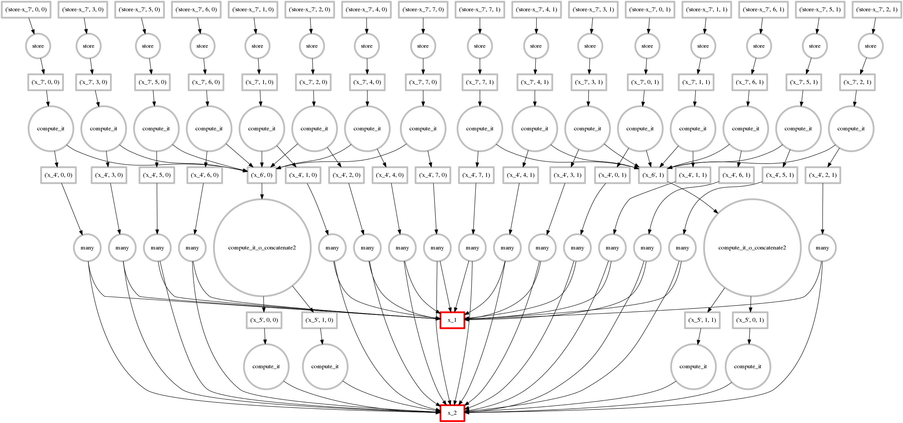

## `dask` tutorial

*Matthew Rocklin*

Continuum Analytics

[http://github.com/ContinuumIO/dask-tutorial/](http://github.com/ContinuumIO/dask-tutorial/)

    python prep.py  # create artificial datasets

### **tl;dr**: `dask` enables parallel computing

### on larger-than-memory data

### `dask` collections mimic known libraries

*  `dask.array` = `numpy` + `threading`
*  `dask.dataframe` = `pandas` + `threading`
*  `dask.bag` = `map, filter, ...` + `multiprocessing`

### `dask` schedulers provide custom parallelism

*  Dynamic and low-latency
*  Memory aware
*  Accessible
*  Arbitrary and simple graph structure

* High level code creates task graph

        x.dot(y) - y.mean(axis=0)

*  Schedulers execute task graph

### Goals

*  Learn to use `dask.array/dataframe/bag`

    to handle 10-100GB datasets on a single machine

*  Learn to use dynamic task scheduling

    to solve custom problems

### Outline

1.  `dask.array`
2.  Foundations
3.  `dask.dataframe`
4.  Imperative graph construction
5.  `dask.bag`
6.  Diagnostics, optimizations, etc..
